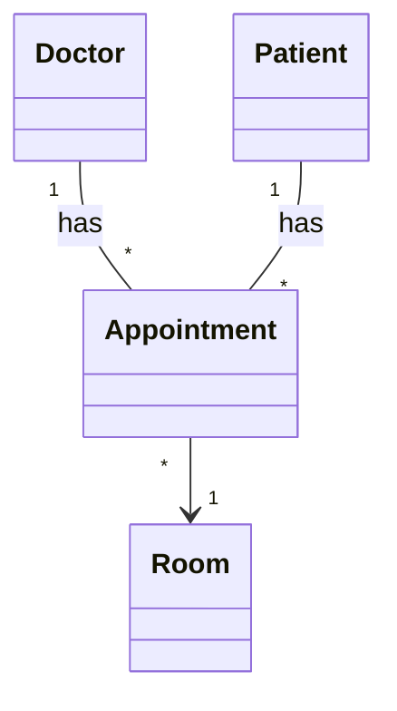

# Association

**Definition:** A "knows-about" or "uses-a" relationship between objects where both exist independently. Neither owns or controls the other.

## Real-World Example

Developer ↔ Repository:
- A developer contributes to multiple repositories
- A repository has multiple contributors
- Deleting a developer doesn't delete the repository
- Archiving a repository doesn't delete the developer

## Code Example

```java
public class Developer {
    private String username;
    private List<Repository> repositories;

    public Developer(String username) {
        this.username = username;
        this.repositories = new ArrayList<>();
    }

    public void contributeTo(Repository repo) {
        repositories.add(repo);
    }
}

public class Repository {
    private String name;
    private List<Developer> contributors;

    public Repository(String name) {
        this.name = name;
        this.contributors = new ArrayList<>();
    }

    public void addContributor(Developer dev) {
        contributors.add(dev);
    }
}

// Both objects created independently
Developer dev = new Developer("alice");
Repository repo = new Repository("payment-service");

// They reference each other, but neither owns the other
dev.contributeTo(repo);
repo.addContributor(dev);
```

## Key Property

**Independence** — Both objects exist outside of each other. Deleting one doesn't affect the other.

## UML Representation

| Symbol | Meaning |
|--------|---------|
| Solid line (`---`) | Association between classes |
| Arrowhead (`-->`) | Directionality |
| No arrowhead | Bidirectional |
| `1` | Exactly one |
| `0..1` | Zero or one |
| `*` | Many |
| `1..*` | At least one |

> Distinguished from: Inheritance (solid + triangle), Aggregation (hollow diamond), Composition (filled diamond)

## Types

### By Direction

- **Unidirectional:** Only one class knows about the other (e.g., `Order` → `PaymentGateway`)
- **Bidirectional:** Both hold references, must stay synchronized

### By Multiplicity

- **1-to-1:** User ↔ Profile
- **1-to-many:** Project → multiple Issues
- **Many-to-many:** Doctor ↔ Patient (via Appointment intermediary)

## Hospital Example UML



Design insights:
1. Appointment intermediary models many-to-many
2. Room relationship is unidirectional
3. Navigation works both ways

## Related Relationships

- Association is the **most general** relationship
- Aggregation and composition are **specialized forms**
- Dependency is **weaker** (temporary usage)

## Related Concepts

[[Aggregation]], [[Composition]], [[Dependency]]