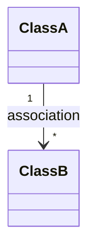
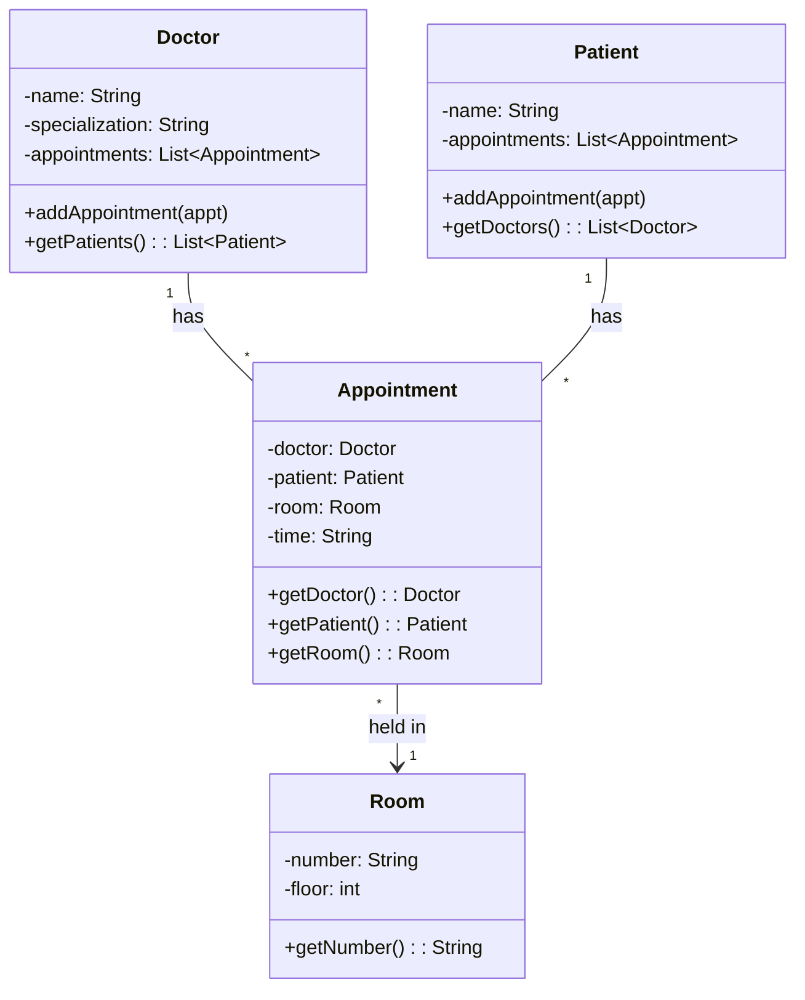

# Association

**Source:** AlgoMaster.io Low-Level Design Course — Association Chapter

## Key Definitions

**Association** represents a relationship between two classes where **one object uses, communicates with, or references another**.

> "One object needs to know about the existence of another object to perform its responsibilities"

### Key Characteristics

1. **"Has-a" or "Uses-a" relationship**
2. Objects are **loosely coupled** — can exist independently
3. Can be **unidirectional or bidirectional**
4. Multiplicity patterns: **1-to-1, 1-to-many, many-to-many**

---

## UML Representation

| Symbol | Meaning |
|--------|---------|
| Solid line (`---`) | Association between classes |
| Arrowhead (`-->`) | Directionality (who knows whom) |
| No arrowhead | Bidirectional association |
| `1` | Exactly one |
| `0..1` | Zero or one (optional) |
| `*` | Many (zero or more) |
| `1..*` | At least one |

**Multiplicity** defines how many instances of one class can be associated with another.

### UML Diagram Example



> **Note:** Distinguished from:
> - Inheritance: solid line + hollow triangle
> - Aggregation: hollow diamond
> - Composition: filled diamond

---

## Types of Association

### Based on Direction (Directionality)

#### Unidirectional Association

Only one class holds a reference to the other. The referenced class has no knowledge of who references it.

```java
class Order {
    private PaymentGateway gateway;
    
    public void checkout() {
        gateway.processPayment(amount);
    }
}

class PaymentGateway {
    public void processPayment(double amount) { }
}
```

**`Order` → `PaymentGateway`** (Order knows about PaymentGateway; PaymentGateway doesn't know about Order)

> **When in doubt, start with unidirectional.** Add bidirectional only when needed.

#### Bidirectional Association

Both classes hold references to each other. Both sides must stay synchronized.

```java
class Team {
    private List<Developer> developers;
    
    public void addDeveloper(Developer dev) {
        developers.add(dev);
        dev.setTeam(this);  // Sync both ways
    }
}

class Developer {
    private Team team;
    
    public void setTeam(Team team) {
        this.team = team;
    }
}
```

### Based on Multiplicity

#### One-to-One

Each object associated with exactly one object of another class.

**Example:** `User` ↔ `Profile`

- Each User has one Profile
- Each Profile belongs to one User

Separating them keeps each class focused (User = auth, Profile = display).

#### One-to-Many

One object linked to multiple objects of another class.

**Example:** `Project` → multiple `Issues`

#### Many-to-Many

Multiple objects associated with multiple objects.

**Important:** Model with an intermediary class (like a join table in databases).

---

## Practical Example: Hospital Appointment System

### Entities

- **Doctor** — name, specialization, appointments
- **Patient** — name, appointments
- **Appointment** — doctor, patient, room, time
- **Room** — number, floor

### Relationships

1. **Appointment → Room** (unidirectional): Room doesn't track appointments
2. **Doctor ↔ Appointment** (bidirectional one-to-many)
3. **Patient ↔ Appointment** (bidirectional one-to-many)
4. **Doctor ↔ Patient** (many-to-many, via Appointment)

### UML Class Diagram



### Key Design Insights

1. **Appointment is the intermediary** — models many-to-many between Doctor and Patient
2. **Navigation works both ways** — walk through appointments to find patients/doctors
3. **Room relationship is unidirectional** — simpler, sufficient for most cases

---

## Key Takeaways

1. Association is the **most fundamental class relationship** — "has-a" or "uses-a"
2. **Start with unidirectional** — simpler and more common
3. **Multiplicity** (1-to-1, 1-to-many, many-to-many) describes connection quantities
4. **Use intermediary class** for many-to-many relationships
5. **Keep bidirectional synchronized** — requires careful maintenance
6. In UML: **solid line** distinguishes from inheritance, aggregation, composition